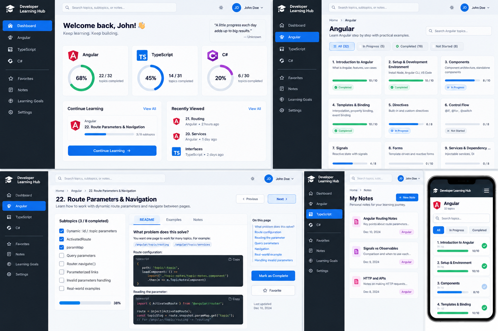

# Developer Learning Hub — Angular Learning + Product Build Master Roadmap

# UI Design Reference

The following mockup is the **visual product direction** for the Developer Learning Hub. It is a reference for the dashboard, technology/topic listing, topic detail/README experience, progress tracking, notes, navigation, and responsive layout. We will build toward this incrementally as the corresponding Angular topics are learned; it is **not** a reason to rewrite the current application.



> **Design rule:** Preserve the current working Learning Hub and evolve it toward this UI through the topic-to-product roadmap below.

---


## Purpose

This document is the **single constructive roadmap** for building the Developer Learning Hub while learning Angular.

It has two equal goals:

1. Learn Angular concepts in a deliberate order.
2. Grow the Learning Hub into a useful application **without repeatedly throwing away earlier work and redesigning from scratch**.

The rule from this point forward is:

```text
Angular concept
      +
planned Learning Hub improvement
      ↓
one meaningful product step
```

We do **not** add Angular syntax just to say that we used it.

We do **not** rebuild the entire application whenever a better architecture is learned later.

We **refactor forward**: preserve working behavior, improve boundaries when the relevant Angular concept is learned, and keep the product usable throughout the learning process.

---

# 1. Final Product We Are Building

The target is an **Angular-only personal Developer Learning Hub** first.

Authentication and a backend are optional future expansions. The core product must work without them.

```text
Developer Learning Hub
│
├── Dashboard
│   ├── Angular progress
│   ├── TypeScript progress
│   ├── C# progress
│   ├── Continue Learning
│   ├── Recently Viewed
│   └── Learning Goal
│
├── Learning
│   │
│   ├── Angular
│   │   ├── Search
│   │   ├── Filter: All / In Progress / Completed / Favorites
│   │   ├── Topic cards
│   │   │   ├── topic number
│   │   │   ├── topic title
│   │   │   ├── subtopics
│   │   │   ├── progress
│   │   │   └── open topic
│   │   │
│   │   └── Topic Detail
│   │       ├── topic title
│   │       ├── README learning content
│   │       ├── subtopic checklist
│   │       ├── progress percentage
│   │       ├── favorite
│   │       ├── personal notes
│   │       ├── previous topic
│   │       └── next topic
│   │
│   ├── TypeScript
│   │   └── same long-term structure
│   │
│   └── C#
│       └── same long-term structure
│
├── Progress
│   ├── completed subtopics
│   ├── completed topics
│   ├── in-progress topics
│   ├── recently viewed
│   └── persistence
│
└── Quality
    ├── loading states
    ├── empty states
    ├── error states
    ├── validation
    ├── accessibility
    ├── testing
    ├── performance
    └── deployment
```

---

# 2. What We Are NOT Doing

We are **not starting again from a blank Angular project**.

The current application already contains valuable pieces:

```text
✓ App shell
✓ technology navigation
✓ Angular topics page
✓ TypeScript topics page
✓ C# topics page
✓ TopicCard
✓ TopicNotes
✓ curriculum JSON
✓ LearningTopic model
✓ TopicService
✓ search
✓ signals
✓ computed search result
✓ effect/localStorage experience
✓ custom pipe
✓ routing
✓ lazy-loaded technology pages
✓ wildcard 404
✓ dynamic topic route
✓ topic slug navigation
✓ ActivatedRoute parameter reading
```

Those are foundations.

Some pieces may later move into better folders or get clearer responsibilities, but **their behavior is preserved**.

---

# 3. Product Architecture Direction

We do not need to force this entire folder structure today.

It is the **destination** we gradually move toward when Topic 34–35 teaches reusable design and application structure.

```text
src/app/
│
├── core/
│   ├── services/
│   ├── models/
│   ├── storage/
│   └── routing/
│
├── features/
│   ├── dashboard/
│   ├── learning/
│   │   ├── technology-topics/
│   │   └── topic-detail/
│   ├── progress/
│   ├── favorites/
│   └── goals/
│
├── shared/
│   ├── components/
│   ├── pipes/
│   └── utilities/
│
├── app.component.*
├── app.config.ts
└── app.routes.ts
```

### Important migration rule

Do not reorganize folders merely because this final structure looks cleaner.

We migrate only when the roadmap reaches the concept that explains **why** we are doing it.

Example:

```text
Today:
src/app/topic-card/

Later during Reusable Component Design:
src/app/shared/components/topic-card/
```

The component is moved; it is **not rewritten from scratch**.

---

# 4. Core Data Design — Build for Progress Tracking Now

The curriculum and user progress should remain separate.

## Curriculum data

Curriculum data answers:

> What topics and subtopics exist?

Eventually:

```ts
interface LearningSubTopic {
  id: string;
  slug: string;
  title: string;
}

interface LearningTopic {
  id: number;
  slug: string;
  title: string;
  readme: string;
  plannedLearningTime: string;
  category: string;
  subTopics: LearningSubTopic[];
}
```

Example:

```json
{
  "id": 22,
  "slug": "route-parameters-navigation",
  "title": "Route Parameters & Navigation",
  "readme": "22-route-parameters-navigation.md",
  "subTopics": [
    {
      "id": "22.1",
      "slug": "dynamic-route-parameters",
      "title": "Dynamic :id / :topic"
    },
    {
      "id": "22.2",
      "slug": "activated-route",
      "title": "ActivatedRoute"
    }
  ]
}
```

We do **not need to convert all existing JSON immediately**. This is the data shape we evolve toward when progress tracking begins.

## Progress data

Progress answers:

> What has this learner completed?

Example:

```ts
interface TopicProgress {
  topicSlug: string;
  completedSubTopicIds: string[];
  favorite: boolean;
  lastViewedAt?: string;
}
```

Example local persistence:

```json
{
  "route-parameters-navigation": {
    "completedSubTopicIds": ["22.1", "22.2", "22.3"],
    "favorite": true
  }
}
```

### Why keep them separate?

```text
Curriculum JSON
→ defines the course

Progress Store
→ defines what the learner has done
```

That means we can later replace `localStorage` with an API/database without rewriting the curriculum.

---

# 5. README Design Direction

Use **one permanent README per main roadmap topic**.

Do not create one README file per tiny subtopic.

Example:

```text
22-route-parameters-navigation.md
```

Inside it, each roadmap subtopic gets a concise beginner-friendly section.

The style should be:

```markdown
## Dynamic Route Parameter

### What does it do?

One route can accept different values.

```ts
{
  path: 'topic/:topic'
  // :topic is the dynamic part of the URL
}
```

Examples:

/angular/topic/components
/angular/topic/routing
```

### README writing rules

- Show the problem first.
- Use small examples.
- Use concrete variable/component names.
- Put comments close to the exact line they explain.
- Avoid large theory paragraphs before the example.
- Keep every roadmap subtopic represented.
- One main topic README can be read top-to-bottom the first time.
- Later, the learner should be able to jump directly to a subtopic section.

Historical daily READMEs can remain as learning history.

Permanent app-facing READMEs become the cleaned reference version.

---

# 6. Current Application Flow

The current Learning Hub is already moving toward the target architecture.

```text
AppComponent
│
├── technology navigation
│
└── RouterOutlet
     │
     ├── /angular
     │      ↓
     │   AngularTopicsComponent
     │      ↓
     │   TopicCard
     │
     ├── /typescript
     │      ↓
     │   TypescriptTopicsComponent
     │
     ├── /csharp
     │      ↓
     │   CsharpTopicsComponent
     │
     └── /angular/topic/:topic
            ↓
         TopicNotes
            ↓
         ActivatedRoute reads topic slug
```

Curriculum flow:

```text
angular-learning-topics.json
        ↓
TopicService
        ↓
AngularTopicsComponent
        ↓
TopicCard
```

The future Topic Detail flow becomes:

```text
/angular/topic/routing
        ↓
TopicDetail / TopicNotes
        ↓
read slug = "routing"
        ↓
find curriculum topic
        ↓
load 21-routing.md
        ↓
read progress for Routing
        ↓
display:
README + subtopic checklist + progress
```

---

# 7. Master Angular Topic → Learning Hub Build Roadmap

---

## TOPIC 1 — Angular Application Setup & Architecture

### Angular learning

- Angular CLI
- `ng new`
- `ng serve`
- SPA startup flow
- `index.html`
- `main.ts`
- `bootstrapApplication`
- root component
- `app.config.ts`
- `angular.json`
- `package.json`
- `src/`
- `public/`
- project structure

### Learning Hub product purpose

Create the application foundation.

### Product implementation

```text
Developer Learning Hub Angular project
        ↓
application boots
        ↓
AppComponent
        ↓
initial shell
```

### Current status

**Built. Keep it.**

### Do not redesign later

The root application remains the bootstrap shell. Later Topic 35 may reduce how much responsibility `AppComponent` owns, but we do not recreate the project.

---

## TOPIC 2 — String Interpolation

### Angular learning

- component properties
- `{{ }}`
- literal vs property
- case sensitivity
- simple template expressions

### Learning Hub product purpose

Render dynamic application text.

### Product implementation

Examples:

```ts
title = 'Developer Learning Hub';
// Text owned by the component
```

```html
<h1>{{ title }}</h1>
<!-- Displays the value of title -->
```

### Current status

**Built. Keep it.**

### Future reuse

Interpolation remains everywhere:

```text
topic title
progress count
learning goal
empty-state messages
recent topic name
```

---

## TOPIC 3 — Components

### Angular learning

- `@Component`
- class/template/styles
- selector
- imports
- standalone components
- component responsibility

### Learning Hub product purpose

Break the application into meaningful UI responsibilities.

### Product implementation

Existing examples include:

```text
AppComponent
AngularTopicsComponent
TypescriptTopicsComponent
CsharpTopicsComponent
TopicCard
TopicNotes
NotFoundComponent
```

### Current status

**Built. Keep all useful components.**

### Future improvement

During Topic 34 we evaluate whether each component has a single responsibility.

We do not prematurely split every component.

---

## TOPIC 4 — Property Binding

### Angular learning

- `[property]`
- TypeScript → template flow
- `[disabled]`
- `[src]`
- boolean binding
- class/style basics
- static assets

### Learning Hub product purpose

Bind application data to UI properties.

### Product implementation

Existing examples:

```html


<button [disabled]="disabledButton">
  Angular
</button>
```

### Future improvement

Progress/status CSS can later use class binding when appropriate:

```html
<div [class.completed]="isCompleted">
```

Do not add this merely for practice until the progress feature exists.

---

## TOPIC 5 — Event Binding

### Angular learning

- `(click)`
- `$event`
- component methods
- state changes
- input/keyboard events

### Learning Hub product purpose

Make the application respond to learner actions.

### Product implementation

Examples:

```text
click technology
click topic
expand subtopics
search typing
later:
check subtopic
favorite topic
retry load
previous/next
```

### Current status

**Built and reused continuously.**

---

## TOPIC 6 — Two-Way Binding

### Angular learning

- `[(ngModel)]`
- `FormsModule`
- TypeScript ⇄ HTML

### Learning Hub product purpose

Support small simple editable values.

### Product implementation

Existing learning goal/input work can remain.

### Future product use

A simple non-critical preference such as:

```text
Current learning goal
display preference
small search/filter input
```

### Design rule

Do not use `ngModel` for every future form.

Later Template-Driven and Reactive Forms decide the appropriate form style.

---

## TOPIC 7 — Angular Template Control Flow

### Angular learning

- `@if`
- `@else`
- `@for`
- `track`
- contextual variables
- `@empty`
- `@switch`

### Learning Hub product purpose

Render curriculum and UI states declaratively.

### Product implementation

Current:

```text
@for
→ topic list

@empty
→ no matching topics

@if
→ expandable subtopics
```

Future:

```text
@if completed
@if favorite
@if loading
@if error

@for completedSubTopics
@for dashboard technologies

@switch filterState
```

### Important architecture lesson already discovered

Do not use `@if` as a substitute for routing between application pages.

The router owns routed page selection.

---

## TOPIC 8 — Parent → Child Communication with `input()`

### Angular learning

- signal inputs
- required/default inputs
- typed inputs
- parent → child ownership

### Learning Hub product purpose

Pass topic data into reusable UI components.

### Product implementation

Current `TopicCard` receives values such as:

```text
topic title
topic index
subtopics
topic slug
```

### Future improvement

Progress-related values may also be inputs to purely presentational components:

```text
progress percentage
completed count
favorite state
```

Only pass what the child needs.

---

## TOPIC 9 — Child → Parent Communication with `output()`

### Angular learning

- `output()`
- `emit()`
- typed payloads
- `$event`

### Learning Hub product purpose

Allow reusable children to announce user actions.

### Product implementation

Existing `TopicCard` output work taught the pattern.

### Architecture evolution

For navigation, the router now gives us a better source of truth than emitting the selected title through multiple layers.

So:

```text
Old learning implementation:
TopicCard output
→ parent
→ shared selected topic state
→ TopicNotes

Improved routing implementation:
TopicCard
→ URL using slug
→ TopicNotes reads URL
```

This is **not deleting the learning**.

It demonstrates an important design rule:

> Use outputs for component events. Use routing for page identity/navigation.

Outputs will still be useful for future reusable components.

---

## TOPIC 10 — Writable Signals

### Angular learning

- `signal()`
- read with `()`
- `set()`
- `update()`
- immutable updates

### Learning Hub product purpose

Represent local reactive state.

### Current implementations

```text
searchText
expand/collapse state
selected/local UI state
```

### Future implementations

Signals become important in:

```text
ProgressService
Favorite state
Recently viewed
Learning goal
Filter state
Loading state
```

### Design rule

Do not duplicate the same state across several components.

---

## TOPIC 11 — Computed Signals

### Angular learning

- `computed()`
- derived state
- dependency tracking
- read-only derived values

### Learning Hub product purpose

Calculate information that should not be manually stored.

### Current implementation

```text
filteredAngularTopics
```

### Major future implementation

Progress should be derived:

```text
completed subtopics
        +
total subtopics
        ↓
computed progress percentage
```

Examples:

```text
Topic progress
Technology progress
Dashboard totals
In-progress filter
Completed filter
```

### Rule

Do not store a percentage independently if it can be calculated from completion state.

---

## TOPIC 12 — Signal Inputs

### Product implementation

Already used in reusable component inputs.

### Future improvement

Potential `computed()` values based on input data can be reinforced through a progress/card component later.

No forced rewrite is required now.

---

## TOPIC 13 — Signal-Based State Changes

### Learning Hub product purpose

Handle actual user actions that modify state.

### Current implementation

Examples include toggling/selected state exercises.

### Future implementation

This topic becomes central when progress tracking is built:

```text
check subtopic
→ update progress signal

uncheck subtopic
→ update progress signal

favorite topic
→ update favorite state
```

---

## TOPIC 14 — `effect()`

### Learning Hub product purpose

Synchronize reactive application state with an external side effect.

### Current implementation

Search persistence experience using `localStorage`.

### Future product implementation

We will use the lesson carefully for persistence concepts such as:

```text
progress changes
→ persist snapshot

recently viewed changes
→ persist snapshot
```

### Important rule

Do not use `effect()` to calculate progress.

That belongs in `computed()`.

---

## TOPIC 15 — TypeScript Models / Interfaces in Angular

### Learning Hub product purpose

Give the Learning Hub a stable data contract.

### Current implementation

`LearningTopic` model exists.

### Planned constructive evolution

We extend rather than replace it:

```ts
LearningTopic
  ↓
add readme field
  ↓
subTopics evolve from string[]
to typed LearningSubTopic[]
```

Future models:

```text
LearningTopic
LearningSubTopic
TopicProgress
TechnologyProgress
LearningGoal
PersonalNote
RequestState
```

### Design rule

Models describe data shapes.

Components should not invent loosely typed anonymous application data everywhere.

---

## TOPIC 16 — Pipes

### Learning Hub product purpose

Format data for display without changing underlying state.

### Existing product use

Title formatting / labels.

### Future product use

Possible examples:

```text
date for "last viewed"
progress display formatting
friendly technology labels
```

No need to force every built-in pipe into the app.

---

## TOPIC 17 — Custom Pipes

### Current product implementation

Existing custom subtopic-label pipe.

### Future rule

Keep it only if it genuinely improves display logic.

Do not move business/progress calculations into pipes.

---

## TOPIC 18 — Services

### Learning Hub product purpose

Move non-visual application responsibilities out of components.

### Existing product implementation

`TopicService`

Current responsibility:

```text
curriculum JSON
→ TopicService
→ topic consumers
```

### Future services

Do not create all immediately.

As features arrive:

```text
TopicService
→ curriculum/topic lookup

ProgressService
→ completion/progress state

StorageService
→ localStorage access

RecentLearningService
→ optional if behavior becomes large

NotesService
→ optional when personal notes arrive
```

### Rule

Create a service because a responsibility exists, not because "services are good."

---

## TOPIC 19 — Dependency Injection

### Learning Hub product purpose

Provide services to the components/features that need them.

### Current implementation

```ts
topicService = inject(TopicService);
```

### Future application

```text
ProgressService
StorageService
HttpClient
ActivatedRoute
Router
```

This is reused naturally throughout the remaining project.

---

## TOPIC 20 — Sharing Data / State with Services

### Learning Hub product purpose

Create shared state with a clear owner.

### Existing learning

Private writable signal / public readonly signal pattern.

### Planned major product use

This becomes the architectural foundation of `ProgressService`.

Example direction:

```ts
private progress = signal<TopicProgress[]>([]);

readonly progressState = this.progress.asReadonly();

completedTopicCount = computed(() => {
  // derive from progress
});
```

### Product rule

```text
Component
→ asks service to update progress

Service
→ owns progress state

Other components
→ read the same shared state
```

Dashboard, topic cards, and topic detail can then see consistent progress.

---

## TOPIC 21 — Routing

### Product implementation already completed

```text
/
→ app shell

/angular
→ AngularTopicsComponent

/typescript
→ TypescriptTopicsComponent

/csharp
→ CsharpTopicsComponent

invalid route
→ NotFoundComponent
```

Also introduced lazy-loaded route components.

### Important constructive improvement already made

The router replaced manual page-level `@if/@else` selection.

Keep this routing foundation.

---

## TOPIC 22 — Route Parameters & Navigation

### Product purpose

Give each learning topic a real URL.

### Current implementation

```text
/angular/topic/components
/angular/topic/routing
/angular/topic/services
```

One dynamic route:

```ts
path: 'topic/:topic'
```

`TopicCard`:

```text
topic slug
→ Router.navigate()
```

`TopicNotes`:

```text
ActivatedRoute
→ paramMap.get('topic')
```

### Remaining learning

- query parameters
- invalid parameter handling

### Product completion target

By the end of Topic 22:

```text
valid topic slug
→ TopicNotes

invalid topic slug
→ friendly Topic Not Found state or redirect

optional query parameter
→ useful display/filter state when justified
```

### Important next bridge

`TopicNotes` is currently only proving that the slug works.

It becomes the real **Topic Detail page** in the upcoming build phases.

---

# NEXT PRODUCT PHASE — TURN THE ROUTED TOPIC PAGE INTO A REAL LEARNING PAGE

Everything above created the foundation.

The next concepts should now build visible product capability.

---

## TOPIC 23 — Forms Fundamentals

### Angular learning

- controls
- values
- submission
- validation
- valid/invalid
- touched/untouched
- dirty/pristine
- template-driven vs reactive forms

### Learning Hub product improvement

**Design the Learning Goal feature and understand what kind of form it needs.**

We do not need a large form yet.

Product target:

```text
Dashboard / Learning Header

Learning Goal
[ Build confidence with Angular routing ]

[ Save Goal ]
```

### Why this feature?

It gives Forms a real product purpose and later appears on the dashboard.

### Implementation scope

At fundamentals stage:

- identify control/value/submission
- identify validation need
- decide whether small goal form should remain template-driven or later become reactive
- do not overbuild

### Existing work preserved

If an existing `[(ngModel)]` goal input exists, use it as the starting point instead of deleting it.

---

## TOPIC 24 — Template-Driven Forms

### Product improvement

Finish the **simple Learning Goal editor**.

Example behavior:

```text
Goal input
→ required
→ submit
→ save goal
→ confirmation
→ reset/edit
```

Use:

```text
FormsModule
ngModel
name
ngForm
ngSubmit
required
control state
validation message
disable submit
reset
```

### Product outcome

A useful small form exists in the app.

### Architecture rule

This remains a simple form. We do not convert it later just because Reactive Forms are learned.

Reactive Forms will get their own more complex feature.

---

## TOPIC 25 — Reactive Forms

### Product improvement

Build **Personal Topic Notes** on the Topic Detail page as the first richer form.

Example:

```text
Topic Detail
│
├── README
├── progress
└── My Notes
    ├── title
    ├── note text
    ├── confidence level
    └── tags / optional controls
```

Use progressively:

```text
FormControl
FormGroup
FormBuilder
patchValue
reset
valueChanges
nested group
FormArray when tags/checklist requires it
```

### Why use Reactive Forms here?

This feature can justify multiple controls and later validation.

### No rewrite rule

Do not convert the simple Learning Goal form just to use Reactive Forms.

Now the app contains both form approaches for legitimate reasons.

---

## TOPIC 26 — Form Validation

### Product improvement

Add proper validation to **Personal Topic Notes** and/or Learning Goal.

Examples:

```text
Goal
→ required
→ sensible length

Personal note
→ optional title
→ max length
→ content validation

confidence
→ valid range
```

### Product UI

Show errors only when appropriate:

```text
invalid + touched
→ show message
```

### Advanced learning

Custom/cross-field validators can be introduced only if a real rule exists.

Do not invent strange rules just to demonstrate a validator.

---

## TOPIC 27 — HTTP Client

### Product improvement

**README Content Loader**

This is the ideal moment to connect the routed Topic Detail page to permanent Markdown files.

Current:

```text
/angular/topic/routing
→ TopicNotes
→ displays "routing"
```

After this topic:

```text
/angular/topic/routing
→ Topic Detail
→ TopicService / ContentService
→ GET /assets/angular-notes/21-routing.md
→ display content
```

### Angular learning

```text
provideHttpClient
HttpClient
typed responses/options
HTTP Observable
params
headers/options
HTTP in services
```

### Product design

HTTP logic should live in a service, not directly scattered through the component.

Possible responsibility:

```text
TopicContentService
→ load README text by topic.readme
```

### Why we waited

We deliberately did not introduce `fetch()` early just to load Markdown before the HTTP topic was learned.

---

## TOPIC 28 — Calling REST APIs

### Product improvement

Create a **clean data-access/service boundary** even if the initial content is local/static.

Two options for learning:

1. Use a safe public/demo API for REST practice while keeping Learning Hub content local.
2. Add a small mock API/dev data source for Learning Hub data.

### Application goal

Learn:

```text
component
→ application service
→ API/data service
→ HTTP
```

without tightly coupling the UI to where data comes from.

### Future readiness

If a .NET backend is added later:

```text
Today:
/assets/... or mock API

Later:
.NET API

Components should not need a total rewrite.
```

---

## TOPIC 29 — Loading, Error & Empty States

### Product improvement

Make README loading and topic data robust.

Topic Detail should support:

```text
Loading...
      ↓
Success
      ↓
README

or

No content available

or

Could not load topic notes
[ Retry ]
```

### Product state

Use clear request-state modeling, for example:

```text
idle
loading
success
empty
error
```

### Important distinction

404 route and content-load error are different problems.

---

## TOPIC 30 — RxJS Fundamentals

### Product improvement

Understand and improve the **README/content loading pipeline**.

Potential flow:

```text
route topic slug
      ↓
find topic
      ↓
load README
      ↓
transform result
      ↓
handle error
      ↓
finalize loading
```

Use concepts such as:

```text
pipe
map
tap
switchMap
catchError
finalize
```

### Product rule

Do not add operators unnecessarily.

Each operator should have a clear job in the Learning Hub flow.

---

## TOPIC 31 — Observables & Subscriptions

### Product improvement

Make route/content streams safe and maintainable.

### Target

When navigating:

```text
/angular/topic/routing
        ↓
/angular/topic/services
```

the Topic Detail page should respond properly without manual refresh.

Use the route as a stream where appropriate.

Practice:

```text
subscribe
async pipe
takeUntilDestroyed
switchMap
HTTP observables
```

### Product quality

Avoid:

```text
subscribe inside subscribe
```

Prefer a clear stream.

---

## TOPIC 32 — Signals and RxJS Together

### Product improvement

Establish a clean state rule for the app.

Use:

```text
Signals
→ synchronous UI/application state

Observables
→ asynchronous streams such as route/HTTP

toSignal
→ when template/component benefits from signal consumption

toObservable
→ only when a signal truly needs to enter an RxJS pipeline
```

### Learning Hub examples

```text
searchText             → signal
progress state         → signal
favorite state         → signal
README HTTP result     → Observable or converted signal
route param stream     → Observable
derived progress       → computed signal
```

### Product outcome

The app stops feeling like random reactive syntax and gets a clear reactive model.

---

## TOPIC 33 — Component Lifecycle

### Product improvement

Audit lifecycle needs in the actual app.

Possible legitimate uses:

```text
focus an element after view init
cleanup manually created resources
initialize non-signal behavior
```

### Product rule

Do not add lifecycle hooks when signals/route streams already solve the problem.

This lesson should improve understanding, not force unnecessary code.

---

## TOPIC 34 — Reusable Component Design

### Major product improvement

This is the first planned **structural refactor**, but it is evolutionary.

Review components:

```text
TopicCard
ProgressBar
SubTopicChecklist
TechnologyProgressCard
EmptyState
ErrorState
LearningGoalForm
PersonalNotesForm
```

### Goal

Separate:

```text
container / feature component
→ owns data/state/orchestration

presentational component
→ receives typed inputs
→ emits typed user events
```

Example:

```text
TopicDetailComponent
├── TopicReadme
├── SubTopicChecklist
├── TopicProgress
└── PersonalNotes
```

### Use

- single responsibility
- typed component APIs
- content projection where helpful
- composition
- avoid over-generalization

### No rewrite rule

Existing components are evaluated and improved one at a time.

---

## TOPIC 35 — Angular Application Structure

### Major product improvement

Now reorganize folders because the concept has been learned.

Possible destination:

```text
src/app/
│
├── core/
│   ├── models/
│   ├── services/
│   └── storage/
│
├── features/
│   ├── dashboard/
│   ├── learning/
│   │   ├── topic-list/
│   │   └── topic-detail/
│   ├── progress/
│   └── goals/
│
├── shared/
│   ├── components/
│   └── pipes/
│
├── app.routes.ts
└── app.component.*
```

### Migration checklist

For every move:

```text
1. move one responsibility
2. repair imports
3. run app
4. test existing routes/features
5. commit
6. move next responsibility
```

Never perform a "big bang rewrite."

### Product outcome

You should finally be able to answer:

> Where is this feature? What component owns it? What service owns its data?

without guessing.

---

## TOPIC 36 — Testing Angular Components & Services

### Product improvement

Protect what we've built.

High-value tests:

```text
TopicCard
→ renders input
→ emits/takes navigation action

TopicService
→ returns curriculum
→ finds topic by slug

ProgressService
→ marks/unmarks subtopics
→ calculates completion correctly

Topic Detail
→ renders correct route topic
→ handles invalid topic
→ loading/error states

Learning Goal Form
→ validation and submission

README loader
→ success and HTTP error
```

### Product goal

Tests should protect actual behavior, not just chase coverage numbers.

---

## TOPIC 37 — Build a Feature Independently

### Major learner milestone

You build one complete Learning Hub feature from requirements with minimal assistance.

Recommended feature:

# Continue Learning

Requirements could include:

```text
Dashboard shows most recently viewed incomplete topic.

Click Continue
→ navigate to that topic.

If no progress exists
→ suggest first Angular topic.

Completed topics should not be chosen as "continue" target.
```

You choose:

- model changes
- service responsibility
- component
- routing
- state
- validation if needed
- tests

### Why this feature?

It combines the concepts learned so far and is genuinely useful.

---

# ADDITIONAL MODERN ANGULAR TOPICS

---

## TOPIC 38 — `linkedSignal()`

### Product improvement

Use only if a real linked-state case exists.

Potential Learning Hub example:

```text
selected technology changes
→ selected topic/filter resets appropriately
```

or:

```text
topic changes
→ topic-specific editable draft resets/recalculates
```

### Rule

If `computed()` or a normal signal is simpler, use the simpler option.

The product does not need to change just to demonstrate `linkedSignal()`.

---

## TOPIC 39 — Route Guards — Basics

### Product improvement without authentication

We can still learn guards without building auth.

Useful Learning Hub example:

```text
route to topic editor/personal-note page
→ guard checks required local condition

or

route to a learning session
→ redirect if topic slug is invalid/unavailable
```

However, invalid topic lookup may be better handled in the component/resolver flow.

### Best educational use

Create a small **Learning Setup Guard** only if we have a meaningful rule, such as:

```text
Learning Goal setup required
→ allow certain flow

otherwise
→ redirect to goal setup
```

### Future extension

If authentication is ever added, guards naturally extend to protected routes.

---

## TOPIC 40 — HTTP Interceptors — Basics

### Product improvement

Because the Learning Hub already loads content/data with HTTP, interceptors can have a real non-auth purpose.

Examples:

```text
common request header
central request logging
centralized API error observation
```

### Do not fake authentication

Auth token behavior can be learned conceptually without pretending the app has secure authentication.

---

## TOPIC 41 — Change Detection & Performance Basics

### Product improvement

Optimize actual large/repeated UI:

```text
topic lists
subtopic checklists
dashboard cards
README rendering
```

Audit:

```text
track list items by stable id
avoid expensive template functions
use signals correctly
understand OnPush
```

### Product goal

Measure/identify a reason before optimizing.

---

## TOPIC 42 — Deferred Loading

### Product improvement

The README/topic page is a good place for deferred secondary content.

Example:

```text
Topic Detail
├── immediate: title + progress
└── deferred:
    ├── Personal Notes
    └── secondary reference panel
```

Use:

```text
@defer
@placeholder
@loading
@error
```

where the UX benefits.

Do not defer critical content merely to use the syntax.

---

## TOPIC 43 — Accessibility Basics

### Product improvement

Accessibility pass across the Learning Hub.

Audit:

```text
technology navigation
topic cards/buttons
search label
forms
validation messages
progress indicators
checkboxes
keyboard navigation
focus state
images/alt text
```

### Product outcome

The application should work through keyboard navigation and expose meaningful form/status information.

---

## TOPIC 44 — Build & Deployment Basics

### Product improvement

Ship the Angular-only Learning Hub.

Learn:

```text
ng build
production build output
static assets
base path
deployment
```

### Deployment target

Choose a simple static Angular hosting platform when this topic arrives.

### Product outcome

The Learning Hub is no longer only a localhost exercise.

---

# 8. Product Feature Roadmap by Phase

The topic-by-topic roadmap above is the learning order.

This section shows the same plan from a product perspective.

---

## PHASE A — Foundation — Mostly Built

```text
✓ Angular app shell
✓ technology selection
✓ topic list
✓ reusable TopicCard
✓ curriculum JSON
✓ search
✓ signals/computed
✓ services/DI
✓ routing
✓ lazy-loaded technology pages
✓ 404
✓ dynamic topic URL
```

Do not rebuild this phase.

---

## PHASE B — Topic Detail / Learning Content — Current Next Major Product Goal

```text
✓ dynamic topic URL
✓ TopicNotes route
✓ route slug reading
□ find topic by slug
□ invalid topic state
□ permanent README mapping
□ README loader
□ render topic README
□ previous / next topic
```

Angular topics involved:

```text
Route Parameters
HTTP Client
RxJS
Loading/Error states
```

---

## PHASE C — Progress Tracking

```text
□ stable subtopic IDs
□ typed LearningSubTopic model
□ ProgressService
□ check/uncheck subtopic
□ per-topic progress
□ completed/in-progress status
□ localStorage persistence
□ progress displayed on topic cards
□ technology-level progress
```

Angular concepts reused:

```text
Models
Services
DI
Signals
computed
effect/persistence
inputs/outputs
control flow
```

This phase should begin once the topic-detail/content structure is stable enough.

---

## PHASE D — Personal Learning Experience

```text
□ Learning Goal
□ Personal Topic Notes
□ Favorites
□ Recently Viewed
□ Continue Learning
□ All / In Progress / Completed / Favorites filters
□ Previous / Next navigation
```

Angular topics:

```text
Forms
Validation
Signals
Services
Routing
Reactive Forms
```

---

## PHASE E — Dashboard

```text
□ Angular progress
□ TypeScript progress
□ C# progress
□ Continue Learning card
□ Recently Viewed
□ Learning Goal
□ completion summary
```

The dashboard should consume existing services/state.

It should **not create a second copy of progress data**.

---

## PHASE F — Architecture & Quality

```text
□ reusable component audit
□ feature-based organization
□ shared components
□ clean service responsibilities
□ testing
□ loading/error polish
□ performance
□ accessibility
□ deployment
```

This happens after the learner has enough Angular knowledge to understand why each change is being made.

---

# 9. Planned Core Components

Do not generate all of these immediately.

They are the likely final component responsibilities.

```text
AppComponent
→ application shell + router outlet

DashboardComponent
→ overall learning dashboard

TechnologyTopicsComponent
→ technology topic list/container

TopicCardComponent
→ reusable topic summary

TopicDetailComponent
→ orchestrates one selected topic

TopicReadmeComponent
→ displays permanent learning content

SubTopicChecklistComponent
→ learner progress interaction

ProgressBarComponent
→ visual progress only

LearningGoalComponent/Form
→ learning goal

PersonalNotesComponent/Form
→ local topic notes

NotFoundComponent
→ unknown application route

TopicNotFoundComponent
→ valid topic route shape, unknown topic slug

EmptyStateComponent
→ reusable empty result state

ErrorStateComponent
→ reusable recoverable error state
```

### Important

`TopicNotes` can evolve into `TopicDetail` rather than being thrown away.

Possible migration:

```text
Today:
TopicNotes

Later:
TopicNotes gains actual topic data + README + progress

During architecture cleanup:
rename TopicNotes → TopicDetailComponent
```

Renaming is optional and should happen only when it improves clarity.

---

# 10. Planned Core Services

Again, create them only when their responsibility becomes real.

```text
TopicService
→ curriculum and topic lookup

TopicContentService
→ README/content loading

ProgressService
→ completed subtopics and derived progress

StorageService
→ localStorage read/write abstraction

LearningGoalService
→ only if goal state becomes shared/complex

PersonalNotesService
→ only if notes persistence becomes substantial
```

Avoid one giant service called something like:

```text
LearningHubService
```

that owns everything.

Also avoid creating ten tiny services before they are needed.

---

# 11. Local Persistence Strategy

Because authentication/backend are not required, the Angular-only app can persist data locally.

Recommended keys:

```text
learningHub.progress.v1
learningHub.goal.v1
learningHub.notes.v1
learningHub.recent.v1
learningHub.preferences.v1
```

The version suffix gives us room to migrate data later.

### Storage ownership

Components should not all call `localStorage` directly.

Long-term:

```text
Component
→ domain service
→ StorageService
→ localStorage
```

Example:

```text
SubTopicChecklist
→ ProgressService.markCompleted(...)
→ ProgressService state updates
→ persistence
```

This keeps future backend migration easier.

---

# 12. Progress Calculation Design

Do not store both:

```text
completedSubtopics
AND
progressPercentage
```

if percentage can be calculated.

Source of truth:

```text
completedSubTopicIds
```

Derived:

```text
completed count
total count
percentage
topic status
technology percentage
overall dashboard percentage
```

Example:

```text
3 completed / 5 total
        ↓
computed()
        ↓
60%
```

Potential status:

```text
0%        → Not Started
1–99%     → In Progress
100%      → Completed
```

This makes the progress model consistent.

---

# 13. Topic Detail Page — Final Target

This is the most important near-term page.

```text
← Angular Topics

22. Route Parameters & Navigation
──────────────────────────────────

Progress: 3 / 8     38%      ☆ Favorite

Subtopics
──────────────────────────────────
☑ Dynamic :id / :topic
☑ ActivatedRoute
☑ paramMap
☐ Query parameters
☐ Router
☐ navigate()
☐ Parameterized links
☐ Invalid parameters

Learning Notes
──────────────────────────────────

[Rendered permanent README]

Personal Notes
──────────────────────────────────
[ editable learner notes ]

[← Routing]                    [Forms Fundamentals →]
```

### Data flow

```text
URL slug
   ↓
TopicService.getTopicBySlug()
   ↓
LearningTopic
   ├── title
   ├── subtopics
   └── readme
         ↓
TopicContentService
         ↓
README

ProgressService
   ↓
completed subtopic IDs
   ↓
SubTopicChecklist + ProgressBar
```

This page connects a large portion of the Angular roadmap into one meaningful feature.

---

# 14. Dashboard — Final Target

```text
Developer Learning Hub
──────────────────────────────────

Continue Learning
Route Parameters & Navigation
Progress: 3 / 8
[ Continue ]

Learning Progress
──────────────────────────────────
Angular       22 / 44 topics
TypeScript    12 / 30 topics
C#             5 / 28 topics

Learning Goal
──────────────────────────────────
Become comfortable building Angular features independently.

Recently Viewed
──────────────────────────────────
Routing
Services
Signals

Favorites
──────────────────────────────────
Computed Signals
Routing
Reactive Forms
```

The dashboard should use data that already exists in services.

It should not own a separate set of progress/favorite values.

---

# 15. Rules That Prevent Another Redesign

These rules are permanent for this project.

## Rule 1 — Preserve working behavior

Before a refactor:

```text
write down what currently works
```

After a refactor:

```text
verify all of it still works
```

---

## Rule 2 — One source of truth

Examples:

```text
Curriculum
→ TopicService/curriculum data

Progress
→ ProgressService

Current routed topic
→ URL / Router

Derived percentage
→ computed()
```

Avoid two different systems representing the same fact.

---

## Rule 3 — Do not force Angular concepts into the app

If a concept has no legitimate Learning Hub use that day:

```text
learn it in a small example
→ identify future use
→ do not damage app architecture just to insert it
```

---

## Rule 4 — Refactor only with a reason

Valid reasons:

```text
component has multiple responsibilities
state is duplicated
service owns unrelated concerns
folder structure is difficult to navigate
code is difficult to test
feature cannot grow safely
```

Invalid reason:

```text
"a tutorial used a different folder structure"
```

---

## Rule 5 — Product requirement before code

Every practical session starts with:

```text
BEFORE
What does the Learning Hub do now?

TODAY'S PRODUCT IMPROVEMENT
What will the user be able to do afterward?

ANGULAR CONCEPT
What Angular feature makes that possible?

FILES/RESPONSIBILITIES
Which existing pieces should change?

DONE
What observable behavior proves completion?
```

---

## Rule 6 — Small migrations

Never:

```text
"Today we will reorganize the whole project."
```

Instead:

```text
move/refactor one feature
→ run
→ test
→ continue
```

---

## Rule 7 — README content and application code are separate concerns

```text
README
→ learning/reference content

Curriculum JSON
→ topic/subtopic metadata

ProgressService
→ learner progress

Router
→ current page identity
```

Do not mix completion flags into Markdown files.

---

# 16. Daily Learning Session Format From Now On

Every new topic should start with these two lines:

```text
ANGULAR TOPIC:
<concept>

LEARNING HUB BUILD:
<specific product improvement>
```

Example:

```text
ANGULAR TOPIC:
HTTP Client

LEARNING HUB BUILD:
Load the correct permanent README into Topic Detail.
```

Then:

```text
1. Roadmap audit
2. 3 warm-up questions — one at a time
3. Concept README
4. Clarification
5. Product Before/After
6. Practical prerequisites
7. Practical requirement
8. Learner implements in small steps
9. Code review/debug
10. Practical Implementation README
11. 5 review questions — one at a time
12. Mark both learning + product progress
```

---

# 17. Build Status Board

This should be kept updated as the application grows.

## Application Foundation

- [x] Angular application
- [x] App shell
- [x] technology navigation
- [x] Angular topics page
- [x] TypeScript topics page
- [x] C# topics page
- [x] reusable TopicCard
- [x] curriculum JSON
- [x] TopicService
- [x] search
- [x] search persistence experience
- [x] routing
- [x] lazy-loaded technology pages
- [x] wildcard 404
- [x] dynamic topic URL
- [x] TopicNotes route
- [x] route parameter reading

## Topic Detail

- [ ] topic lookup by slug
- [ ] unknown topic handling
- [ ] permanent README file mapping
- [ ] README content loading
- [ ] Markdown/content rendering
- [ ] previous topic
- [ ] next topic

## Progress

- [ ] stable subtopic IDs
- [ ] `LearningSubTopic` model
- [ ] `TopicProgress` model
- [ ] ProgressService
- [ ] subtopic checkbox
- [ ] mark complete
- [ ] unmark complete
- [ ] topic percentage
- [ ] topic status
- [ ] topic-card progress
- [ ] technology progress
- [ ] progress persistence

## Personal Learning

- [ ] learning goal
- [ ] validation
- [ ] personal topic notes
- [ ] favorites
- [ ] recently viewed
- [ ] Continue Learning
- [ ] filters

## Dashboard

- [ ] Angular progress
- [ ] TypeScript progress
- [ ] C# progress
- [ ] Continue Learning
- [ ] learning goal
- [ ] recently viewed
- [ ] favorites summary

## Quality

- [ ] loading state
- [ ] error state
- [ ] empty state
- [ ] retry
- [ ] form validation quality
- [ ] component/service tests
- [ ] HTTP tests
- [ ] accessibility pass
- [ ] performance pass
- [ ] production build
- [ ] deployment

---

# 18. Immediate Next Steps — Do Not Jump Ahead

We should not try to build the entire target application now.

The next order is:

```text
1. Finish Topic 22
   → query params
   → invalid topic parameters

2. Stabilize Topic Detail routing
   → topic lookup by slug
   → friendly unknown-topic behavior

3. Topic 23–26 Forms
   → Learning Goal
   → Personal Topic Notes
   → validation

4. Topic 27 HTTP Client
   → load permanent README

5. Topic 29–32 async state/RxJS
   → robust README/topic loading

6. Begin Progress feature
   → typed subtopic IDs
   → ProgressService
   → checkboxes
   → computed progress
   → persistence

7. Dashboard consumes the progress system

8. Topic 34–35
   → reusable design
   → feature/core/shared restructuring

9. Testing / performance / accessibility / deployment
```

### Why progress is not Step 2

Progress tracking depends on a stable topic/subtopic identity model.

We can design it now, but implementing it carefully after Topic Detail is stable avoids creating progress state around pages/data that are still changing.

This is **planning ahead without prematurely building everything**.

---

# 19. Definition of "Learning Hub Complete — Angular-Only Version"

We can call the first major version complete when:

```text
✓ technologies are navigable
✓ topics come from curriculum data
✓ each topic has a unique URL
✓ each topic displays its permanent README
✓ each topic displays its subtopics
✓ learner can mark subtopics complete
✓ progress survives reload/restart on that browser
✓ topic progress is calculated
✓ technology progress is calculated
✓ dashboard summarizes progress
✓ search/filter works
✓ favorites work
✓ Continue Learning works
✓ learning goal works
✓ personal notes work
✓ loading/error/empty states are handled
✓ important components/services are tested
✓ application is accessible at a basic level
✓ production build succeeds
✓ app is deployed
```

Authentication is **not required** for this version.

The accepted limitation is:

```text
progress belongs to this browser/device
```

A future backend/authentication phase can replace local persistence without throwing away the Angular UI and application architecture.

---

# 20. Long-Term Optional Expansion

Only after the Angular-only Learning Hub is mature:

```text
Angular frontend
      ↓
.NET / C# API
      ↓
database
      ↓
authentication
      ↓
user-specific synced progress
```

That is a future project phase, not a requirement for the current Angular learning journey.

---

# 21. Permanent Product Principle

The Learning Hub should become more useful after each meaningful Angular topic.

The learner should always be able to answer:

```text
What Angular concept did I learn?

What problem does it solve?

Where did I use it in the Learning Hub?

What product capability did that add?

What component/service owns that behavior now?

How does data move through the feature?
```

If we cannot answer those questions, we should not rush to the next implementation.

---

# 22. Master Memory Rule

```text
DO NOT RESTART.

Understand existing behavior
        ↓
learn the next Angular concept
        ↓
add one planned product capability
        ↓
preserve existing behavior
        ↓
refactor only when the roadmap teaches
why the refactor is useful
        ↓
test
        ↓
continue building forward
```

This is the development strategy for the **Developer Learning Hub**.
